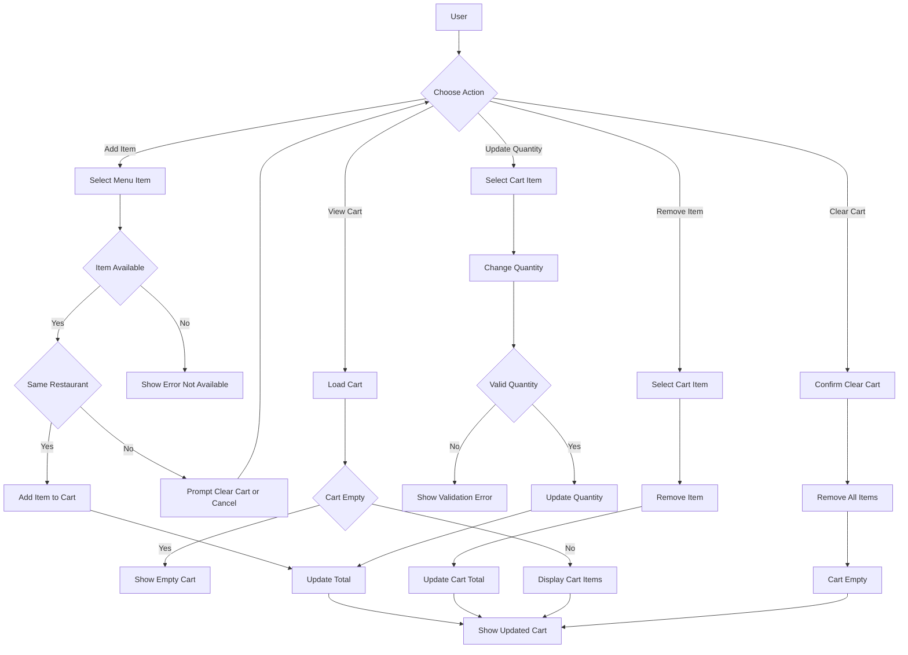
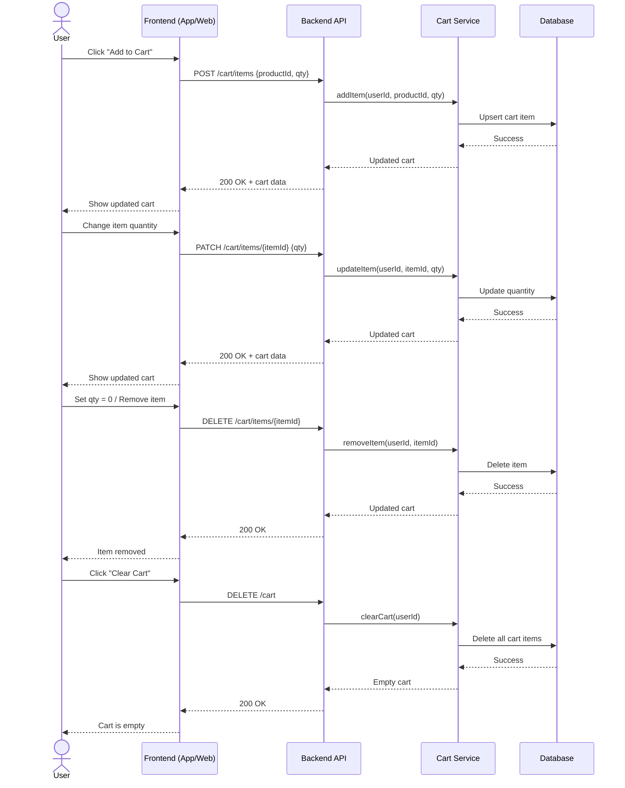

# 📚 ECOMMERCE PROJECT README

## Table of Contents

- [Overview](#overview)
- [Vision](#vision)
- [Mission](#mission)
- [Actors of the System](#actors-of-the-system)
- [Functional Requirements](#functional-requirements)
- [Non Functional Requirements](#non-functional-requirements)
- [ERD](#erd)
- [User Stories](#user-stories)
- [Flow Charts](#flow-charts)
- [Sequence Diagrams](#sequence-diagrams)
- [Assumptions](#assumptions)
- [Tech Stack](#tech-stack)
- [Setup & Installation Guide](#setup--installation-guide)
- [API Documentation](#api-documentation)
- [Testing Suite](#testing-suite)

---

## 🗂️Overview

Foodlify is an e-commerce platform dedicated to revolutionizing the dining and food delivery experience. It connects customers with various restaurants, allowing them to browse menus, manage shopping carts, and place orders intuitively. The system supports robust user management with distinct roles, extensive restaurant menu configurations, real-time order tracking, and secure multi-option payment integrations to ensure a smooth end-to-end transaction.

---

## 🧭Vision

To become the leading and most trusted food-commodity e-commerce ecosystem, providing a seamless bridge between culinary businesses and customers through innovative technology. We aim to make quality food globally accessible while empowering restaurants to scale their reach digitally.

---

## 🎯Mission

To deliver a reliable, intuitive, and scalable food delivery platform that simplifies the ordering process for customers. We strive to provide restaurants with robust tools to manage their menus, track orders, and process payments securely and efficiently.

---

## 👥Actors of the System

1. **End User (Customer)** will be able to:

- Discover many categories of restaurants.
- Create his own cart and adjust it.
- Complete purchasing order with multiple payment methods.
- Real-time tracking of his order status.
- Get high levels of customer service satisfaction.

2. **Restaurant Owner** will be able to:

- Add his restaurant information and its related menus through simple interactive platform.
- View his required orders and interact with them.
- Monitor his progress through analytical and reporting dashboard.

3. **Delivery Rider** will be able to:

- Accept/decline delivery requests
- Navigate to pickup & drop-off
- Update delivery status
- View earnings

4. **System Admin** will be able to:

- Overview and manage entire platform.
- Manage users and restaurants accounts.
- Monitor Orders and disputes.
- Configure promotions.
- access to dashboards and reporting tools.

5. **System** Should be able to:

- Ensure reliable order processing.
- Maintain data consistency.
- Enable real-time communication.

<!-- List and describe all actors (users, systems, roles) that interact with the system. -->

---

## 📦Functional Requirements

### Features:

1. User Registration & Authentication.
2. Restaurant & Menu Management.
3. Cart Management.
4. Order Management.
5. Payment Integration Management.
6. Customer Support Management.
7. Notification & Email Management
8. Dashboard & Reports

### Functions:

### 1. User Registration & Authentication

        1. Create Account /Sign Up
        2. Login
        3. Logout
        4. Forget Password
        5. Enable/Disable Account
        7. User Profile: Show, Edit.

### 2. Restaurant & Menu Management

        1. Add Restaurant
        2. Update Restaurant
        3. Delete Restaurant
        4. View Restaurants - Categories Tabs - Recommendations - Near You - Daily Offers- Top Rating ...
        5. View Single Restaurant
        6. Search Restaurant
        7. Add Menu
        8. Update Menu
        9. Delete Menu
        10. View Menu
        11. Filter Menu / Item

### 3. Cart Management

        1. Add to cart
        2. Modify cart
            2.1 Add items
            2.2 Remove items
            2.3 Change quantity (+, -)
        3. Clear cart
        4. Checkout

### 4. Order Management

        1. Place Order
        2. Receive order by restaurant
        3. Cancel Order by customer/restaurant
        4. Track Order
        5. View Order summary
        6. View Order details
        7. View Orders History
        8. Update Order Status
        9. Send Email confirmation
        10. Send order status notification

### 5. Payment Integration Management

        1. Payment Integration with 3rd Party
        2. Select Payment method
        3. Create Transaction
        4. View Payment Transaction
        5. Create Transaction Receipt
        6. send Email Notification

### 6. Customer support Management

        1. Raise a Complain
        2. Add Rate to restaurant
        3. Need Help
        4. Customer Add Card

---

## ⚙️Non Functional Requirements

<!-- List all non-functional requirements: performance, scalability, security, availability, etc. -->

| # | NFR Category | Detailed Requirement | Architecture Decisions | Technologies / Tools |
|---|---|---|---|---|
| 1 | Performance | API response time <= 300 ms, page load <= 2s | Use in-memory caching, CDN for static assets, DB indexing, and pagination | Redis, Cloudflare / AWS CloudFront |
| 2 | Performance | Handle high read traffic efficiently | Cache frequently accessed data such as restaurants and menus | Redis |
| 3 | Scalability | Support 10k+ concurrent users | Horizontal scaling with stateless services | Docker, Kubernetes |
| 4 | Security | Encrypt all data in transit | Enforce HTTPS (TLS) across all services | TLS |
| 5 | Security | Secure password storage | Hash passwords with strong algorithms | bcrypt |
| 6 | Security | Secure authentication | Token-based authentication | JWT |
| 7 | Security | Prevent common attacks (SQLi, XSS, CSRF) | Rate limiting, input validation, WAF, and API protection | NGINX, API Gateway |
| 8 | Security | Secure payment processing | Use a PCI-compliant payment gateway | Stripe |
| 9 | Availability | System uptime >= 99.9% | Multi-instance deployment with no single point of failure | Kubernetes |
| 10 | Availability | Ensure service continuity | Health checks and auto-restart for failed services | Kubernetes |
| 11 | Reliability | No data loss in orders | Use transactional database operations | PostgreSQL |
| 12 | Reliability | Prevent duplicate orders and payments | Use idempotency keys for critical APIs | Redis / DB |
| 13 | Reliability | Handle partial failures | Add retry mechanisms and circuit breakers | App logic / middleware |
| 14 | Usability | Smooth and fast UX | Use lazy loading, optimized UI, and minimal steps | React / Next.js |
| 15 | Compatibility | Support web and mobile platforms | Use an API-first architecture | REST API |
| 16 | Maintainability | Easy to extend and modify | Follow clean layered architecture (controller -> service -> repository) | Service-based structure, system design patterns |
| 17 | Maintainability | Code consistency | Enforce linting and formatting | ESLint, Prettier |
| 18 | Observability | Log and monitor critical events | Use structured logging and metrics dashboards | Winston, Prometheus, Grafana |
| 19 | Payment Reliability | Payment success rate >= 99% | Retry failed payments and process webhook confirmations | Stripe, Queues |
| 20 | Network | Handle poor network conditions | Add retry logic and timeout handling | Client + Server logic |
| 21 | Network | Improve perceived performance | Use offline UI fallback with cached data | Browser cache |
| 22 | Testability | Ensure code quality | Use unit and integration testing | Jest, Supertest |

---

## 📊ERD


<!-- Include the Entity Relationship Diagram (ERD) here. You can embed an image or link to it. -->

---

## User Stories

### Epic 3: Cart Management

- **Feature name**: Cart Management
- **Description**: Showing all User stories related to creating a cart then adding, modifying and deleting items within it.
- **Acceptance Criteria**: Gherkin
- **Story 3-1**: Add To Cart

```gherkin
  As a customer
  I want to create my cart and add items to it
  So that I can review and modify my order before checkout
Background:
    Given the user is logged in
     And  the user has selected a restaurant
Happy_cases:
  Scenario_1: Add item to cart successfully
     Given the menu item is available
     When  the user adds the item to the cart
     Then  the item should be added to the cart
      And  the cart total should be updated
Edge cases:
  Scenario_1: Add unavailable item to cart
     Given the menu item is unavailable
     When  the user tries to add the item to the cart
     Then  the action should be prevented
      And  an error message should be displayed
```

- **Story 3-2**: Modify Cart- Remove item

```gherkin
  As a customer
  I want to manage my cart
  So that I can review and modify my order before checkout

Happy_cases:
  Scenario_1: Remove item from cart
     Given the cart contains an item
     When  the user removes the item
     Then  the item should be removed from the cart
      And  the cart total should be updated
```

- **Story 3-3**: Modify Cart- Modify item quantity

```gherkin
  As a customer
  I want to manage my cart
  So that I can review and modify my order before checkout

Happy_cases:
  Scenario_1: Modify item quantity in cart successfully
    Given the cart contains an item
    When  the user increases or decreases the item quantity
    Then  system checks stock in case of increase
     And  enough quantity response
     And  the item quantity should be updated
     And  the cart total should be recalculated
Edge cases:
  Scenario_1: Modify cart with invalid quantity
    Given the cart contains an item
    When  the user increases the item quantity
    Then  system check stock in case of increase
     And  No enough quantity response
    Then  the system should show low stock error
     And  the quantity should not be updated
```

- **Story 3-4**: Clear Cart

```gherkin
  As a customer
  I want to clear my cart
  So that I no more need now

Happy_cases:
  Scenario: Clear entire cart
    Given the cart contains multiple items
    When  the user chooses to clear the cart
    Then  all items should be removed from the cart
     And  the cart should be empty
```

- **Story 3-4**: View Cart

```gherkin
  As a customer
  I want to view my cart
  So that I can review and modify my order before checkout

Happy_cases:
  Scenario: View cart details
    Given the cart contains items
    When  the user views the cart
    Then  all items with their quantities and prices should be displayed
     And  the total amount should be shown
```

---

## 🔄Flow Charts

### 3- Cart Management



<!-- Include flow charts that illustrate the main processes and workflows of the system. -->

---

## 🧩Sequence Diagrams

### 3- Cart Management



<!-- Include sequence diagrams that show how components interact over time for key use cases. -->

---

## 🧾Assumptions

<!-- List any assumptions made during design or development of the system. -->

---

## Tech Stack

- **Runtime & Environment:** Node.js
- **Backend Framework:** Express.js
- **Database:** PostgreSQL
- **ORM:** Prisma
- **API Documentation:** Swagger / OpenAPI
- **Containerization:** Docker
- **Version Control:** Git & GitHub

---

## 🚀Setup & Installation Guide

Follow these steps to run the project from a fresh clone until the API is working correctly.

### Prerequisites

- Git
- Docker & Docker Compose
- Node.js 24 or later and `pnpm` only if you want to use the hybrid local setup

### Installation Steps (Recommended: Full Docker)

1. **Clone the repository and navigate to the project directory:**

   ```bash
   git clone https://github.com/Foodlify/Group-2-Team-2.git
   cd Group-2-Team-2
   ```

2. **Create the environment file:**

   ```bash
   cp .env.example .env
   ```

   The default `.env.example` is already configured for the local Docker setup.

3. **Start the full application stack:**

   ```bash
   docker compose up --build
   ```

   This starts:
   - the PostgreSQL database in Docker
   - the API in Docker
   - the Prisma migrations automatically before the API starts

4. **Wait until the app is ready:**

   The setup is successful when the logs show:

   ```text
   ✅ Connected to DB (Prisma)
   🚀 Server running on port 3000
   ```

5. **Verify the application:**

   Open `http://localhost:3000/` in your browser.

   The root route should return a JSON response that includes `status: "OK"`.

6. **Open the API documentation:**

   Visit `http://localhost:3000/api-docs`

### Alternative: Hybrid Local Setup

Use this mode if you want the database in Docker but the API running locally with `pnpm`.

1. **Start only the database:**

   ```bash
   docker compose up -d db
   ```

2. **Install dependencies:**

   ```bash
   pnpm install
   ```

3. **Apply the existing database migrations:**

   ```bash
   pnpm prisma migrate deploy
   ```

4. **Start the API locally:**

   ```bash
   pnpm dev
   ```

5. **Verify the application:**

   Open `http://localhost:3000/`

### Notes

- Do not run `pnpm prisma db push` on the same Docker database if you plan to use the full Docker flow with `prisma migrate deploy`.
- If the Docker app shows `P3005` because the database is already populated, reset the local Docker database and start again:

  ```bash
  docker compose down -v
  docker compose up --build
  ```

- Do not run `pnpm dev` and `docker compose up --build` at the same time, because both try to use port `3000`.
---


## API Documentation

Once the server is running, explore the Swagger documentation at:
`http://localhost:3000/api-docs`

---

## 🧪Testing Suite

<!-- Describe the testing strategy, tools used, and how to run the tests. -->

---
