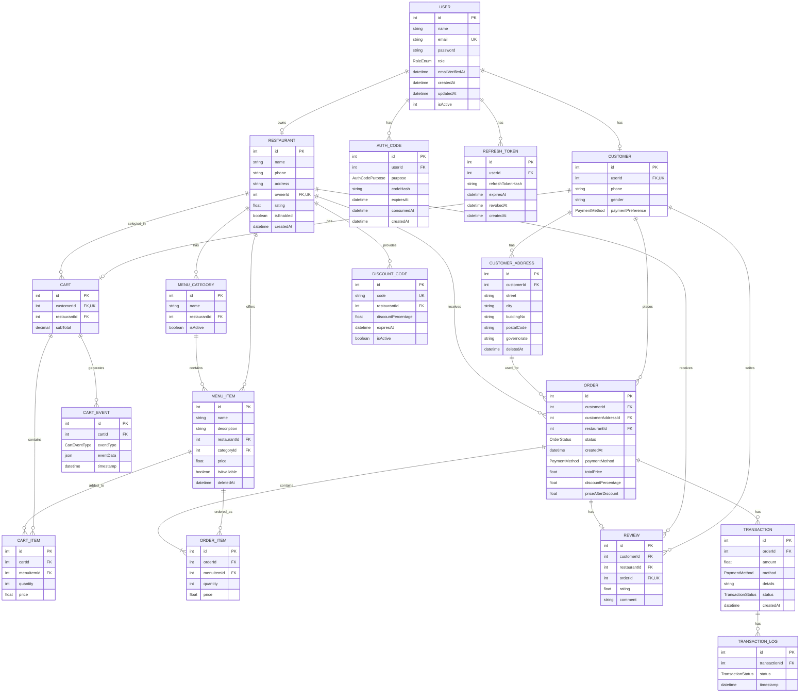

## 📊 ERD

```mermaid
erDiagram

    USER {
        int id PK
        string name
        string email UK
        string password
        RoleEnum role
        datetime emailVerifiedAt
        datetime createdAt
        datetime updatedAt
        int isActive
    }

    CUSTOMER {
        int id PK
        int userId FK,UK
        string phone
        string gender
        PaymentMethod paymentPreference
    }

    AUTH_CODE {
        int id PK
        int userId FK
        AuthCodePurpose purpose
        string codeHash
        datetime expiresAt
        datetime consumedAt
        datetime createdAt
    }

    REFRESH_TOKEN {
        int id PK
        int userId FK
        string refreshTokenHash
        datetime expiresAt
        datetime revokedAt
        datetime createdAt
    }

    CUSTOMER_ADDRESS {
        int id PK
        int customerId FK
        string street
        string city
        string buildingNo
        string postalCode
        string governorate
        datetime deletedAt
    }

    RESTAURANT {
        int id PK
        string name
        string phone
        string address
        int ownerId FK,UK
        float rating
        boolean isEnabled
        datetime createdAt
    }

    MENU_CATEGORY {
        int id PK
        string name
        int restaurantId FK
        boolean isActive
    }

    MENU_ITEM {
        int id PK
        string name
        string description
        int restaurantId FK
        int categoryId FK
        float price
        boolean isAvailable
        datetime deletedAt
    }

    CART {
        int id PK
        int customerId FK,UK
        int restaurantId FK
        decimal subTotal
    }

    CART_ITEM {
        int id PK
        int cartId FK
        int menuItemId FK
        int quantity
        float price
    }

    CART_EVENT {
        int id PK
        int cartId FK
        CartEventType eventType
        json eventData
        datetime timestamp
    }

    ORDER {
        int id PK
        int customerId FK
        int customerAddressId FK
        int restaurantId FK
        OrderStatus status
        datetime createdAt
        PaymentMethod paymentMethod
        float totalPrice
        float discountPercentage
        float priceAfterDiscount
    }

    ORDER_ITEM {
        int id PK
        int orderId FK
        int menuItemId FK
        int quantity
        float price
    }

    REVIEW {
        int id PK
        int customerId FK
        int restaurantId FK
        int orderId FK,UK
        float rating
        string comment
    }

    DISCOUNT_CODE {
        int id PK
        string code UK
        int restaurantId FK
        float discountPercentage
        datetime expiresAt
        boolean isActive
    }

    TRANSACTION {
        int id PK
        int orderId FK
        float amount
        PaymentMethod method
        string details
        TransactionStatus status
        datetime createdAt
    }

    TRANSACTION_LOG {
        int id PK
        int transactionId FK
        TransactionStatus status
        datetime timestamp
    }

    USER ||--o| CUSTOMER : has
    USER ||--o| RESTAURANT : owns
    USER ||--o{ AUTH_CODE : has
    USER ||--o{ REFRESH_TOKEN : has

    CUSTOMER ||--o| CART : has
    CUSTOMER ||--o{ ORDER : places
    CUSTOMER ||--o{ REVIEW : writes
    CUSTOMER ||--o{ CUSTOMER_ADDRESS : has

    CUSTOMER_ADDRESS ||--o{ ORDER : used_for

    RESTAURANT ||--o{ MENU_CATEGORY : has
    RESTAURANT ||--o{ MENU_ITEM : offers
    RESTAURANT ||--o{ REVIEW : receives
    RESTAURANT ||--o{ DISCOUNT_CODE : provides
    RESTAURANT ||--o{ ORDER : receives
    RESTAURANT ||--o{ CART : selected_in

    MENU_CATEGORY ||--o{ MENU_ITEM : contains

    CART ||--o{ CART_ITEM : contains
    CART ||--o{ CART_EVENT : generates

    MENU_ITEM ||--o{ CART_ITEM : added_to
    MENU_ITEM ||--o{ ORDER_ITEM : ordered_as

    ORDER ||--|{ ORDER_ITEM : contains
    ORDER ||--o| REVIEW : has
    ORDER ||--o{ TRANSACTION : has

    TRANSACTION ||--o{ TRANSACTION_LOG : has
```